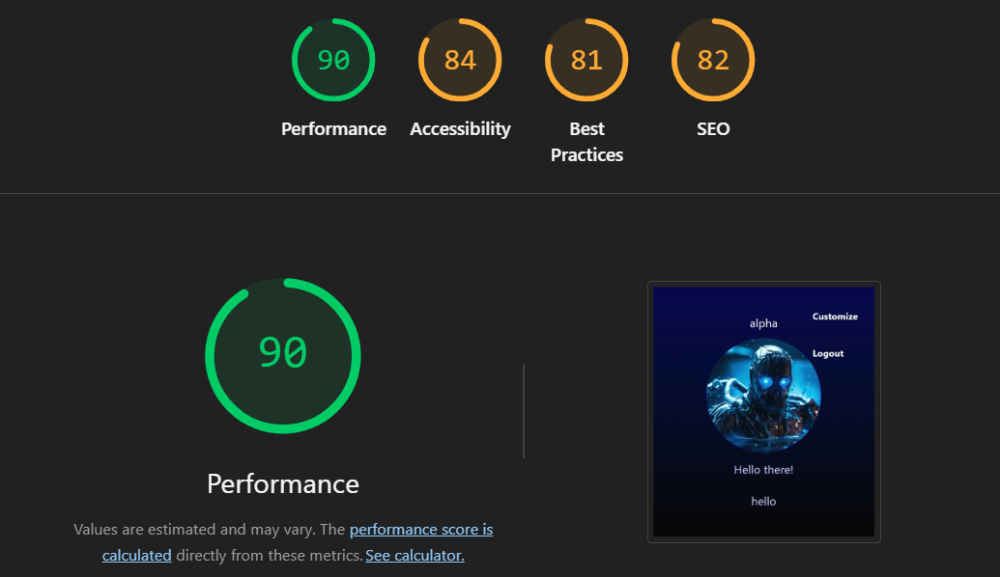

# AI Virtual Assistant

A full-stack AI-powered virtual assistant web application built with React (Vite) for the frontend and Node.js/Express/MongoDB for the backend. The app leverages modern authentication, user customization, and integrates with AI APIs for smart responses and voice interaction.

---

## 🚀 Features

- **User Authentication:** Signup, login, and session management with JWT cookies.
- **AI Assistant:** Interact with an AI assistant for text and voice-based queries.
- **Voice Recognition & Synthesis:** Uses browser APIs for speech-to-text and text-to-speech.
- **User Customization:** Users can set their assistant's name and avatar.
- **Image Uploads:** Upload and store images via Cloudinary.
- **Persistent User Data:** MongoDB for user and assistant data.
- **Modern UI:** Responsive, clean React interface.

---

## 🛠️ Tech Stack

- **Frontend:** React (Vite), Axios, React Router, Tailwind CSS
- **Backend:** Node.js, Express, MongoDB (Mongoose), express-session, JWT, bcryptjs, Cloudinary
- **Deployment:** Render.com (separate services for client and server)

---

## 📚 Folder Structure

```
virtual_assistant_ai_powered/
├── client/         # React frontend (Vite)
│   ├── src/
│   │   ├── pages/          # Main app pages (Home, Signin, Signup, Customize, etc.)
│   │   ├── components/     # Reusable UI components
│   │   ├── context/        # React Context for user/session
│   │   ├── assets/         # Images and static assets
│   │   └── ...
│   ├── public/
│   └── ...
├── server/         # Node.js/Express backend
│   ├── controllers/    # Route controllers (auth, user, AI, etc.)
│   ├── models/         # Mongoose models
│   ├── routes/         # Express routes
│   ├── config/         # DB, Cloudinary, token config
│   ├── middlewares/    # Auth, multer, etc.
│   └── ...
└── README.md
```

---

## 🌐 Working Methodology

1. **User signs up or logs in.**
2. **Session token** is set as a secure, HTTP-only cookie.
3. **User customizes** their assistant (name, avatar).
4. **User interacts** with the AI assistant via text or voice.
5. **AI responses** are generated and spoken back using browser APIs.
6. **User data** and preferences are stored in MongoDB.

---

## 🔑 API Endpoints

### Auth

- `POST /user/signup` — Register a new user
- `POST /user/signin` — Login
- `GET /user/logout` — Logout

### User

- `GET /current` — Get current user info (auth required)
- `POST /current` — Update user assistant info (auth required)

### AI

- `POST /command` — Send a prompt to the AI assistant (auth required)

---

## ⚙️ Setup & Development

### Prerequisites

- Node.js (v18+ recommended)
- MongoDB Atlas account (or local MongoDB)
- Cloudinary account (for image uploads)

### 1. Clone the repository

```bash
git clone https://github.com/yourusername/virtual_assistant_ai_powered.git
cd virtual_assistant_ai_powered
```

### 2. Setup Environment Variables

Create `.env` files in both `client/` and `server/`:

#### `client/.env`

```
VITE_serverurl=https://your-backend-url.onrender.com
```

#### `server/.env`

```
PORT=7001
MONGODB_URI=your_mongodb_connection_string
CLOUDINARY_CLOUD_NAME=your_cloud_name
CLOUDINARY_API_KEY=your_api_key
CLOUDINARY_API_SECRET=your_api_secret
SESSION_SECRET=your_session_secret
SALT=10
```

### 3. Install Dependencies

```bash
cd client
npm install
cd ../server
npm install
```

### 4. Run Locally

- **Backend:**
  ```bash
  cd server
  npm start
  ```
- **Frontend:**
  ```bash
  cd client
  npm run dev
  ```

### 5. Deploy on Render

- Deploy `client/` as a Static Site (build command: `npm run build`, publish dir: `dist`)
- Deploy `server/` as a Web Service (start command: `npm start`)
- Set all environment variables in Render dashboard
- Add a rewrite rule for SPA routing: `/*` → `/index.html`

---

## 📝 Notes

- **Cookies & Auth:** For cross-domain auth, cookies are set with `SameSite: none` and `secure: true`. Both frontend and backend must use HTTPS.
- **CORS:** Backend CORS is configured to allow frontend origin and credentials.
- **Voice Features:** Uses browser Web Speech API for speech recognition and synthesis.
- **Image Uploads:** Images are uploaded to Cloudinary and URLs are stored in MongoDB.

---

## ⚠️ Known Limitations & Drawbacks

- **API Limits:**
  - The AI (Google Gemini) API may have rate limits or quota restrictions, which can result in errors or delayed responses if exceeded.
- **Error Messages:**
  - Common errors include:
    - `user already exists` (on signup with an existing email)
    - `password length less than 3` (on signup)
    - `Incorrect password` (on login)
    - `User not found` (on login)
    - `Missing fields` (on profile update)
    - 400/401/404/500 errors for invalid requests or server issues
- **Cloudinary Avatar Upload:**
  - User-uploaded images as avatars may not always work due to file size/type restrictions or Cloudinary API issues. This feature may need further testing and improvement.
- **UI/UX:**
  - The UI is functional but could be improved for accessibility, responsiveness, and visual polish.
- **API Optimization:**
  - Some API endpoints could be optimized for speed and error handling. More robust validation and error reporting is recommended.
- **Browser Compatibility:**
  - The app uses the Web Speech API, which is supported in most modern browsers but may not work in all (especially on mobile or older browsers).
- **Session/Cookie Issues:**
  - Cross-domain cookies may not work in all browsers or in incognito/private mode due to third-party cookie restrictions.

---

## 🧭 Future Improvements & Ideas

- **Personalized Wake Words:**
  - Allow users to set custom wake words for the assistant.
- **Alarm/Reminder Setting:**
  - Add the ability for users to set alarms or reminders via voice or text.
- **Better Avatar Support:**
  - Improve the reliability of user-uploaded avatars and add cropping/preview features.
- **UI Enhancements:**
  - Add dark mode, animations, and more responsive layouts.
- **API Rate Limit Handling:**
  - Show user-friendly messages when API limits are reached.
- **Multi-language Support:**
  - Add support for more languages in both UI and voice features.
- **Mobile Optimization:**
  - Improve experience on mobile devices.
- **More AI Integrations:**
  - Integrate with other AI APIs for broader capabilities.

---

## 🤖 Purpose & Motivation

This project demonstrates a modern, full-stack AI-powered assistant with real user authentication, persistent customization, and voice interaction. It’s a template for building advanced, interactive web apps with AI integration.

---

## 📬 Contact

For questions or contributions, open an issue or pull request on GitHub.

---

## 🧰 Main Packages & Tools Used

### Backend (server/)

- **express** — Web server framework
- **multer** — File upload handling
- **dotenv** — Environment variable management
- **mongoose** — MongoDB object modeling
- **nodemon** — Auto-restart dev server
- **cookie-parser** — Cookie parsing middleware
- **jsonwebtoken** — Web token authentication
- **bcryptjs** — Password hashing
- **cloudinary** — Image upload to cloud
- **cors** — Cross-origin resource sharing

### Frontend (client/)

- **Vite** — Fast React build tool
- **Tailwind CSS** — Utility-first CSS framework
- **react-router-dom** — Routing
- **axios** — HTTP requests
- **react-icons** — Icon library

### Other

- **Web Speech API** — Built-in browser API for speech recognition and synthesis
- **Google Gemini API** — AI assistant integration
